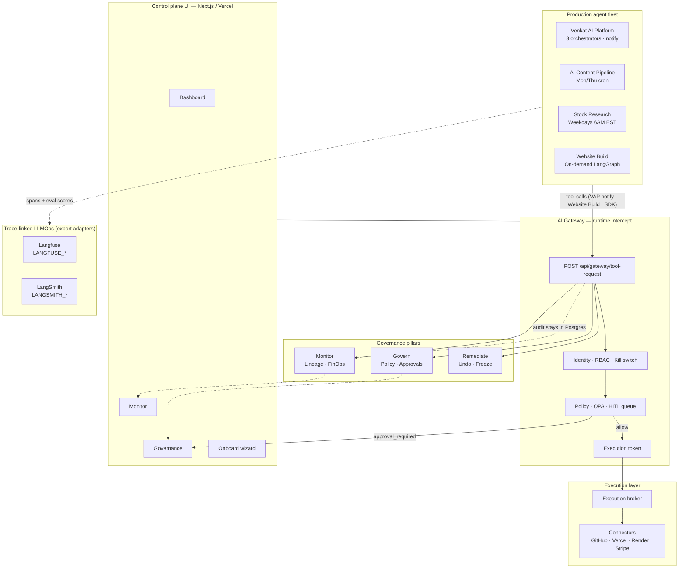
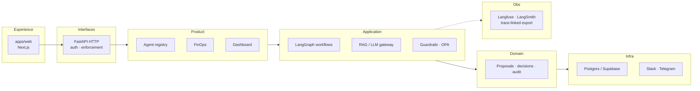
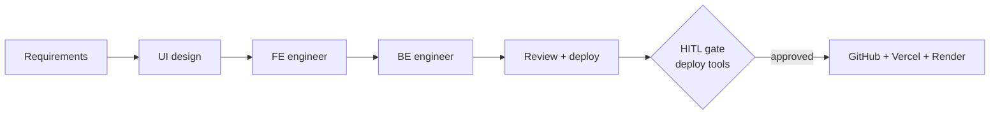
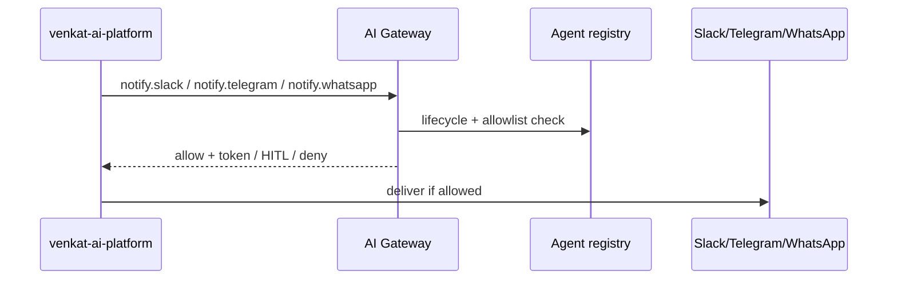

# AegisAI — Enterprise Agent Governance Control Plane


<!-- vpeetla-tech-stack:start -->
[]() []() []() []() []() []() []() []() []()
<!-- vpeetla-tech-stack:end -->
## Agent skills (Cursor + Codex)

Org skills: [vpeetla-ai-skills](https://github.com/vpeetla-ai/vpeetla-ai-skills). This repo includes `.cursor/skills/`, `AGENTS.md`, and `CONTEXT.md`.

```bash
git clone https://github.com/vpeetla-ai/vpeetla-ai-skills.git
./vpeetla-ai-skills/scripts/install.sh --cursor --codex --project .
```

---

[](https://aegisai-enterprise-agent-platform.vercel.app)
[](https://aegisai-api.onrender.com/docs)
[]()

**Monitor → Govern → Remediate** — a production control plane for live AI agent fleets, not another agent builder.

> Production agents connect through an **AI Gateway** for tool authorization: identity, RBAC, policy, HITL approval, signed audit, and FinOps — before side effects execute.

[▶ Live control plane](https://aegisai-enterprise-agent-platform.vercel.app) · [📖 North-star architecture](platform/architecture/ARCHITECTURE.md) · [🔗 Ecosystem map](docs/ECOSYSTEM.md) · [🔑 Deploy & secrets](platform/architecture/DEPLOYMENT-AND-SECRETS.md)

**Portfolio:** [Case study](https://github.com/vpeetla-ai/ai-architecture-portfolio/blob/main/case-studies/aegisai-agent-governance.md) · [Tradeoffs](docs/PRODUCT.md)

## Why this exists

Most teams ship agents first and add governance later. That fails when agents can deploy code, call financial APIs, or push to production without oversight.

AegisAI is a **governance control plane**:

| Problem | AegisAI answer |
|---------|----------------|
| Unknown agent behavior | Monitor lineage, FinOps, activity board |
| Ungoverned tool calls | AI Gateway intercept on every tool request |
| Risky deploy actions | OPA policy + **forced HITL** for `deploy_*` tools |
| No audit trail | Signed audit packets + export |
| Shadow agents | Onboarding lifecycle: Shadow → Pilot → Approved |

---

## Implementation status (honest)

| Component | Status |
|-----------|--------|
| AI Gateway (`POST /api/gateway/tool-request`) | ✅ Production |
| Website Build orchestrator + HITL on deploy | ✅ Gateway-integrated |
| Python gateway SDK (`sdk/python/`) | ✅ |
| TypeScript reference client (`apps/web/lib/gateway/`) | ✅ In-repo reference (not npm package) |
| Control plane UI (dashboard, monitor, governance) | ✅ |
| Content + Stock cron orchestrators | ✅ Managed runs (no per-tool gateway intercept yet); now require `AuthRequired` like every other mutating route — see [ADR-0003](adr/0003-orchestrator-auth-gate.md) |
| Agent registry Postgres persistence | ✅ `AEGISAI_DB_BACKEND=postgres` — SQLite (dev default) or Postgres via `factory.py` |
| OPA policy engine | 🟡 Optional — default is builtin policy simulator; **fails open** (advisory, not a hard block) when unavailable |
| VAP notify gateway | ✅ Wired (`aegis_gateway.py`) |
| ai-content-factory publish | 🟡 Planned |
| Cron orchestrator notify | 🟡 Planned |
| Langfuse + LangSmith traces | ✅ | Optional `LANGFUSE_*` / `LANGSMITH_*` — `GET /api/observability/status` |
| Real FinOps metering + budget enforcement | ✅ Website Build's 4 LLM-calling agents (`agent-requirements-analyst`, `agent-ui-design-analyst`, `agent-fe-builder`, `agent-be-builder`) via [agent-finops](https://github.com/vpeetla-ai/agent-finops) — a budget breach trips the real kill-switch. `ai_content_pipeline`/`stock_research` agents not wired yet. See [ADR-0004](adr/0004-real-finops-metering-website-build.md) |
| MCP — gate inbound (agent → external MCP server) | ✅ `McpGovernanceProxy` routes every outbound MCP tool call through policy/HITL/kill-switch before it reaches `filesystem`/`github`/`postgres`/`slack`/`custom_enterprise_mcp` |
| MCP — expose outbound (external client → AegisAI) | ✅ `interfaces/mcp/server.py` exposes `list_registered_agents`, `check_agent_budget`, `get_kill_switch_status`, `run_website_build` as real MCP tools, calling the same governed singletons the HTTP API uses — see [ADR-0005](adr/0005-mcp-tool-exposure.md) |
| Real AWS deploy path (ECS Fargate + RDS + ALB) | ✅ `deploy/terraform/aws/` — verified with a real `terraform apply`/`destroy` cycle against a live AWS account (real orchestrator run completed against real RDS-backed persistence, then torn down). See [ADR-0006](adr/0006-paas-vs-iac-deploy-tradeoffs.md) |

**Free tier:** manual Render web service + GitHub Actions cron ([DEPLOYMENT-AND-SECRETS.md](platform/architecture/DEPLOYMENT-AND-SECRETS.md)). **`render.yaml` Blueprint** is optional paid (~$9/mo).

---

## 60-second overview

```text
Agent fleet → AI Gateway (policy + HITL) → Connectors (GitHub, Vercel, Render, Stripe…)
           ↘ Control plane UI (dashboard, monitor, governance, onboard)
```

---

## Architecture

### North-star control plane



Note: **Governed audit, HITL, and policy state remain in AegisAI** — Langfuse/LangSmith are trace/eval export adapters (`GET /api/observability/status`).

### Layered backend (clean architecture)



### Website Build orchestrator (LangGraph)



Deploy tools (`deploy.vercel_release`, `deploy.render_release`, `github.create_pull_request`, `github.push_files`) are **`approval_required`** at runtime.

### VAP notify flow (integrated)



---

## Key capabilities

| Capability | Details |
|------------|---------|
| **AI Gateway** | Intercept, simulate policy, issue execution tokens |
| **HITL approvals** | In-app queue + Slack approvals |
| **Agent onboarding** | Register → Shadow → Pilot → Approved |
| **Managed orchestrators** | Content pipeline, stock research, website build |
| **Policy engine** | Builtin simulator + optional OPA (`platform/policy/aegisai.rego`) |
| **Observability** | Langfuse + LangSmith traces |
| **SDKs** | Python: `sdk/python/` · TS reference: `apps/web/lib/gateway/client.ts` |

---

## Quick start (local)

```bash
./scripts/dev.sh
# or: make dev
```

| Service | URL |
|---------|-----|
| Control plane UI | http://localhost:3000 |
| API docs | http://localhost:8000/docs |

```bash
make verify
```

### MCP server (governed tools for Claude Code, Cursor, Claude Desktop)

```bash
claude mcp add aegisai-governance -- \
  env PYTHONPATH=services/api/src uv run python -m aegisai.interfaces.mcp.server
```

Or point any MCP client at `services/api/src/aegisai/interfaces/mcp/server.py` directly
(stdio transport). Every tool call — including `run_website_build` — executes against
the same governed singletons the HTTP API uses, so real FinOps metering and kill-switch
enforcement apply identically. See [ADR-0005](adr/0005-mcp-tool-exposure.md).

---

## Deploy (free tier)

| Layer | Service |
|-------|---------|
| Frontend | Vercel (`apps/web`) |
| API | Render (Docker) |
| Database | Supabase Postgres |
| Schedulers | GitHub Actions + Render cron |

Step-by-step: [DEPLOYMENT-AND-SECRETS.md](platform/architecture/DEPLOYMENT-AND-SECRETS.md)

---

## Project structure

```text
aegisai-enterprise-agent-platform/
├── apps/web/              # Next.js control plane UI
├── services/api/          # FastAPI — gateway, product, orchestration
├── orchestrators/         # Phase-2 stubs (canonical code: services/api/.../orchestration/)
├── sdk/python/            # Gateway SDK
├── platform/
│   ├── architecture/      # North-star docs
│   ├── policy/              # OPA Rego rules
│   └── database/            # Postgres migrations
└── adr/                   # Architecture decision records
```

---

## Related projects

See [docs/ECOSYSTEM.md](docs/ECOSYSTEM.md) for how repos connect.

| Project | Role |
|---------|------|
| [venkat-ai-platform](https://github.com/vpeetla-ai/venkat-ai-platform) | Multi-agent OS — notify gateway integrated |
| [ai-content-factory](https://github.com/vpeetla-ai/ai-content-factory) | Content pipeline — application layer with its own HITL gate |
| [enterprise_rag_platform](https://github.com/vpeetla-ai/enterprise_rag_platform) | Governed RAG reference architecture |

Built by [Venkata Peetla](https://github.com/vpeetla-ai) — [venkat-ai.com](https://venkat-ai.com)

If this helps your agent governance work, a ⭐ helps other architects find it.
