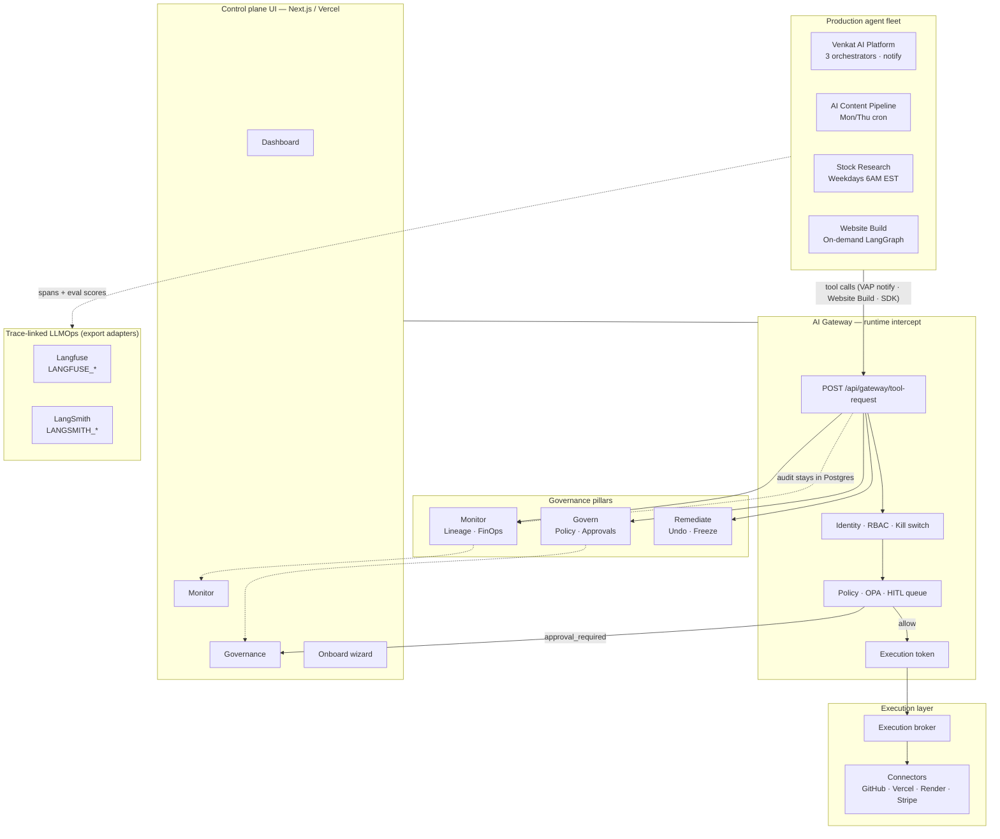
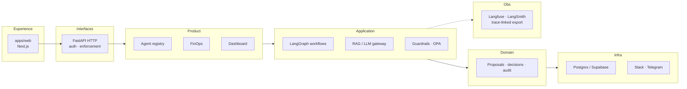
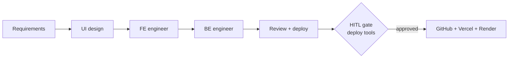
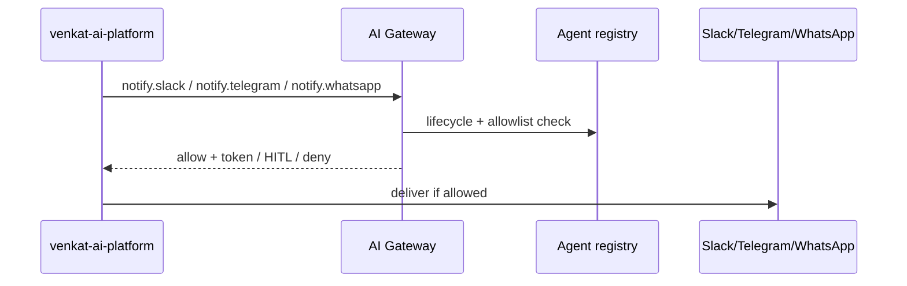

# AegisAI — Enterprise Agent Governance Control Plane


<!-- vpeetla-tech-stack:start -->
[]() []() []() []() []() []() []() []() []()
<!-- vpeetla-tech-stack:end -->
## Agent skills (Cursor + Codex)

Org skills: [vpeetla-ai-skills](https://github.com/vpeetla-ai/vpeetla-ai-skills). This repo includes `.cursor/skills/`, `AGENTS.md`, and `CONTEXT.md`.

```bash
git clone https://github.com/vpeetla-ai/vpeetla-ai-skills.git
./vpeetla-ai-skills/scripts/install.sh --cursor --codex --project .
```

---

[](https://aegisai-enterprise-agent-platform.vercel.app)
[](https://aegisai-api.onrender.com/docs)
[](https://github.com/vpeetla-ai/aegisai-enterprise-agent-platform/actions/workflows/ci.yml)
[]()

**Job of the system:** sit in front of live agents and decide whether a tool call may execute — identity, policy, HITL, signed audit, FinOps — then let the graph keep orchestrating. Not another agent builder.

> Agents propose. The **AI Gateway** authorizes. Side effects don't fire on hope.

[▶ Live control plane](https://aegisai-enterprise-agent-platform.vercel.app) · [📖 North-star architecture](platform/architecture/ARCHITECTURE.md) · [🔗 Ecosystem map](docs/ECOSYSTEM.md) · [🔑 Deploy & secrets](platform/architecture/DEPLOYMENT-AND-SECRETS.md)

**Portfolio:** [Case study](https://github.com/vpeetla-ai/ai-architecture-portfolio/blob/main/case-studies/aegisai-agent-governance.md) · [Tradeoffs](docs/PRODUCT.md)

## Why this exists

Teams ship agents first and bolt on governance later. That fails the first time an agent can deploy, spend, or notify without a named approver.

AegisAI is the **governance control plane** for that scar:

| Problem | AegisAI answer |
|---------|----------------|
| Unknown agent behavior | Monitor lineage, FinOps, activity board |
| Ungoverned tool calls | AI Gateway intercept on every tool request |
| Risky deploy actions | OPA policy + **forced HITL** for `deploy_*` tools |
| No audit trail | Signed audit packets + export |
| Shadow agents | Onboarding lifecycle: Shadow → Pilot → Approved |

**Demo vs Strict:** public demo may seed monitor events when audit is empty; `PRODUCTION_STRICT=true` disables seed. Auth enforcement (`AEGISAI_ENFORCE_AUTH`) and OPA hard-block are opt-in — see the status table. Panel Strict local: [`docs/STRICT_PANEL_PACK.md`](docs/STRICT_PANEL_PACK.md).

---

## Implementation status (honest)

| Component | Status |
|-----------|--------|
| AI Gateway (`POST /api/gateway/tool-request`) | ✅ Production |
| LLM Gateway Plane Control Room | ✅ Tabs for aegis-llm-gateway + semantic-cache ops via BFF (`/api/llm-plane/*`); **observes** enforce+record decisions — does **not** select models (ADR-029) |
| Cost-per-compliant-outcome KPI | ✅ `GET /api/finops/kpi/cost-per-compliant-outcome` → live [agent-finops](https://github.com/vpeetla-ai/agent-finops) when `AGENTFINOPS_API_URL` set |
| Agent registry self-serve | ✅ Onboard wizard + list POST real entries; LLM Plane → Registry tab |
| Website Build orchestrator + HITL on deploy | ✅ Gateway-integrated |
| Python gateway SDK (`sdk/python/`) | ✅ |
| TypeScript reference client (`apps/web/lib/gateway/`) | ✅ In-repo reference (not npm package) |
| Control plane UI (dashboard, monitor, governance) | ✅ |
| Glass-box workbench UX | ✅ Three-column Architecture · enforcement_steps replay · governed intercept |
| Seed monitor / demo activity | ✅ Demo default seeds synthetic monitor events when audit is empty; **`PRODUCTION_STRICT=true` disables seed** so Monitor shows only real audit rows (empty until traffic) |
| Content + Stock cron orchestrators | ✅ Managed runs (no per-tool gateway intercept yet); now require `AuthRequired` like every other mutating route — see [ADR-0003](adr/0003-orchestrator-auth-gate.md) |
| Agent registry Postgres persistence | ✅ `AEGISAI_DB_BACKEND=postgres` — SQLite (dev default) or Postgres via `factory.py` |
| OPA policy engine | 🟡 Optional in demo (builtin fallback). Under **`PRODUCTION_STRICT=true`**, irreversible / customer-impact / high-risk tools **hard-block** when OPA or the policy pack is unavailable (`policy_unavailable`) — see [ADR-0007](adr/0007-fail-closed-policy-plane.md) |
| Agent passport + token revoke | ✅ Registry purpose / expiry / eval baseline; TTL execution tokens with `jti`; `POST /api/execution-tokens/revoke` |
| MCP discovery trust gate | ✅ `POST /api/mcp/discover` scans manifests before tools reach the model ([ADR-0008](adr/0008-mcp-discovery-metadata-gate.md)) |
| Incident evidence pack | ✅ `GET /api/evidence-packs/{tenant}/{case}` + sample [`docs/samples/incident-evidence-pack.json`](docs/samples/incident-evidence-pack.json) |
| Golden eval CI gate | ✅ `aegisai.gateway_invariant_v1` via `golden-eval-registry` (CI checkout) |
| Strict panel pack | ✅ [`docs/STRICT_PANEL_PACK.md`](docs/STRICT_PANEL_PACK.md) · `./scripts/run_strict_local.sh` · `./scripts/probe_strict_panel.sh` |
| VAP notify gateway | ✅ Wired (`aegis_gateway.py`) |
| ai-content-factory publish | ✅ Wired — ACF calls `POST /api/gateway/tool-request` for `publish.{platform}` via `aegis_gateway.py` (fail-closed under `PRODUCTION_STRICT`) |
| Cron orchestrator notify | 🟡 Partial — content/stock cron are AuthRequired managed runs; per-tool notify intercept still incomplete |
| Langfuse + LangSmith traces | ✅ | Optional `LANGFUSE_*` / `LANGSMITH_*` — `GET /api/observability/status`; also mirrored on `GET /api/v1/ops/metrics` with pending HITL count |
| Real FinOps metering + budget enforcement | ✅ Website Build's 4 LLM agents + **AI Content Pipeline** `agent-content-topic-architect` via [agent-finops](https://github.com/vpeetla-ai/agent-finops). Stock research has no LLM `complete()` today (synthetic briefing) — not metered. See [ADR-0004](adr/0004-real-finops-metering-website-build.md) |
| MCP — gate inbound (agent → external MCP server) | ✅ `McpGovernanceProxy` routes every outbound MCP tool call through policy/HITL/kill-switch before it reaches `filesystem`/`github`/`postgres`/`slack`/`custom_enterprise_mcp` |
| MCP — expose outbound (external client → AegisAI) | ✅ `interfaces/mcp/server.py` exposes `list_registered_agents`, `check_agent_budget`, `get_kill_switch_status`, `run_website_build` as real MCP tools, calling the same governed singletons the HTTP API uses — see [ADR-0005](adr/0005-mcp-tool-exposure.md) |
| Real AWS deploy path (ECS Fargate + RDS + ALB) | ✅ `deploy/terraform/aws/` — verified with a real `terraform apply`/`destroy` cycle against a live AWS account (real orchestrator run completed against real RDS-backed persistence, then torn down). See [ADR-0006](adr/0006-paas-vs-iac-deploy-tradeoffs.md) |

**Free tier:** manual Render web service + GitHub Actions cron ([DEPLOYMENT-AND-SECRETS.md](platform/architecture/DEPLOYMENT-AND-SECRETS.md)). **`render.yaml` Blueprint** is optional paid (~$9/mo).

---

## 60-second overview

```text
Agent fleet → AI Gateway (policy + HITL) → Connectors (GitHub, Vercel, Render, Stripe…)
           ↘ Control plane UI (dashboard, monitor, governance, LLM Plane, onboard)
Apps → aegis-llm-gateway (+ semantic cache) → providers   # model plane — separate from tool gateway
```

---

## Architecture

Canonical: [`docs/diagrams/canonical-architecture.mmd`](docs/diagrams/canonical-architecture.mmd)

### North-star control plane


```mermaid
flowchart TB
    subgraph Fleet["Production agent fleet"]
        VAP["Venkat AI Platform<br/>3 orchestrators · notify"]
        CONTENT["AI Content Pipeline<br/>Mon/Thu cron"]
        STOCK["Stock Research<br/>Weekdays 6AM EST"]
        WEB["Website Build<br/>On-demand LangGraph"]
    end

    subgraph Gateway["AI Gateway — runtime intercept"]
        GW["POST /api/gateway/tool-request"]
        ID["Identity · RBAC · Kill switch"]
        POL["Policy · OPA · HITL queue"]
        TOK["Execution token"]
    end

    subgraph Pillars["Governance pillars"]
        MON["Monitor<br/>Lineage · FinOps"]
        GOV["Govern<br/>Policy · Approvals"]
        REM["Remediate<br/>Undo · Freeze"]
    end

    subgraph UI["Control plane UI — Next.js / Vercel"]
        DASH["Dashboard"]
        MON_UI["Monitor"]
        GOV_UI["Governance"]
        ONB["Onboard wizard"]
    end

    subgraph Exec["Execution layer"]
        BRK["Execution broker"]
        CONN["Connectors<br/>GitHub · Vercel · Render · Stripe"]
    end

    Fleet -->|"tool calls (VAP notify · Website Build · SDK)"| GW
    GW --> ID --> POL
    POL -->|"allow"| TOK --> BRK --> CONN
    POL -->|"approval_required"| GOV_UI
    GW --> MON
    GW --> GOV
    GW --> REM
    UI --- Gateway
    MON -.-> MON_UI
    GOV -.-> GOV_UI

    subgraph Obs["Trace-linked LLMOps (export adapters)"]
        LF["Langfuse<br/>LANGFUSE_*"]
        LS["LangSmith<br/>LANGSMITH_*"]
    end
    Fleet -.->|"spans + eval scores"| Obs
    GW -.->|"audit stays in Postgres"| MON
```

Note: **Governed audit, HITL, and policy state remain in AegisAI** — Langfuse/LangSmith are trace/eval export adapters (`GET /api/observability/status`).

**Fleet honesty:** Content + Stock cron orchestrators are managed AegisAI routes (status ✅). Per-tool gateway intercept is wired for VAP notify · Website Build · SDK consumers — not every fleet box above is gateway-intercepted on every call.

### Layered backend (clean architecture)


```mermaid
flowchart LR
    subgraph Experience
        WEB["apps/web<br/>Next.js"]
    end
    subgraph Interfaces
        API["FastAPI HTTP<br/>auth · enforcement"]
    end
    subgraph Product
        REG["Agent registry"]
        FIN["FinOps"]
        DASH["Dashboard"]
    end
    subgraph Application
        LG["LangGraph workflows"]
        RAG["RAG / LLM gateway"]
        GR["Guardrails · OPA"]
    end
    subgraph Domain
        DOM["Proposals · decisions · audit"]
    end
    subgraph Infra
        DB["Postgres / Supabase"]
        NTF["Slack · Telegram"]
    end
    subgraph Obs
        LF["Langfuse · LangSmith<br/>trace-linked export"]
    end

    WEB --> API --> Product --> Application --> Domain --> Infra
    Application -.-> Obs
```

### Website Build orchestrator (LangGraph)


```mermaid
flowchart LR
    REQ["Requirements"] --> UI["UI design"]
    UI --> FE["FE engineer"]
    FE --> BE["BE engineer"]
    BE --> REV["Review + deploy"]
    REV --> HITL{"HITL gate<br/>deploy tools"}
    HITL -->|"approved"| LIVE["GitHub + Vercel + Render"]
```

Deploy tools (`deploy.vercel_release`, `deploy.render_release`, `github.create_pull_request`, `github.push_files`) are **`approval_required`** at runtime.

### VAP notify flow (integrated)


```mermaid
sequenceDiagram
    participant VAP as venkat-ai-platform
    participant GW as AI Gateway
    participant REG as Agent registry
    participant N as Slack/Telegram/WhatsApp
    VAP->>GW: notify.slack / notify.telegram / notify.whatsapp
    GW->>REG: lifecycle + allowlist check
    GW-->>VAP: allow + token / HITL / deny
    VAP->>N: deliver if allowed
```

---

## Key capabilities

| Capability | Details |
|------------|---------|
| **AI Gateway** | Intercept, simulate policy, issue execution tokens |
| **HITL approvals** | In-app queue + Slack approvals |
| **Agent onboarding** | Register → Shadow → Pilot → Approved |
| **Managed orchestrators** | Content pipeline, stock research, website build |
| **Policy engine** | Builtin simulator + optional OPA (`platform/policy/aegisai.rego`) |
| **Observability** | Langfuse + LangSmith traces |
| **SDKs** | Python: `sdk/python/` · TS reference: `apps/web/lib/gateway/client.ts` |

---

## Quick start (local)

```bash
./scripts/dev.sh
# or: make dev
```

| Service | URL |
|---------|-----|
| Control plane UI | http://localhost:3000 |
| API docs | http://localhost:8000/docs |

```bash
make verify
```

### Production honesty (`PRODUCTION_STRICT`)

| Mode | Monitor activity when audit is empty |
|------|--------------------------------------|
| Demo (default) | Synthetic seed events so the dashboard looks alive |
| `PRODUCTION_STRICT=true` | **No seed** — activity list stays empty until real gateway/audit events exist |

Set the org flag on Render (or local) when reviewing production posture:

```bash
export PRODUCTION_STRICT=true
```

See portfolio [ADR-024](https://github.com/vpeetla-ai/ai-architecture-portfolio/blob/main/adr/ADR-024-production-strict-fail-closed.md) and [ADR-025](https://github.com/vpeetla-ai/ai-architecture-portfolio/blob/main/adr/ADR-025-nist-ai-rmf-threat-model.md).

### MCP server (governed tools for Claude Code, Cursor, Claude Desktop)

```bash
claude mcp add aegisai-governance -- \
  env PYTHONPATH=services/api/src uv run python -m aegisai.interfaces.mcp.server
```

Or point any MCP client at `services/api/src/aegisai/interfaces/mcp/server.py` directly
(stdio transport). Every tool call — including `run_website_build` — executes against
the same governed singletons the HTTP API uses, so real FinOps metering and kill-switch
enforcement apply identically. See [ADR-0005](adr/0005-mcp-tool-exposure.md).

---

## Deploy (free tier)

| Layer | Service |
|-------|---------|
| Frontend | Vercel (`apps/web`) |
| API | Render (Docker) — [aegisai-api.onrender.com](https://aegisai-api.onrender.com) — cold start ~30s |
| Database | Supabase Postgres |
| Schedulers | GitHub Actions + Render cron |

> **First-run note:** The Render API sleeps after inactivity on the free tier. The first request after idle takes ~30s to wake; the Vercel control-plane UI loads immediately.

Step-by-step: [DEPLOYMENT-AND-SECRETS.md](platform/architecture/DEPLOYMENT-AND-SECRETS.md)

---

## Project structure

```text
aegisai-enterprise-agent-platform/
├── apps/web/              # Next.js control plane UI
├── services/api/          # FastAPI — gateway, product, orchestration
├── orchestrators/         # Legacy stubs — canonical Content/Stock cron live in services/api/.../orchestration/
├── sdk/python/            # Gateway SDK
├── platform/
│   ├── architecture/      # North-star docs
│   ├── policy/              # OPA Rego rules
│   └── database/            # Postgres migrations
└── adr/                   # Architecture decision records
```

---

## Interview map

**Business function:** Enterprise agent governance — AI gateway, OPA policy, HITL, signed audit, FinOps before side effects.

Staff+ prep crosswalk — [playbook](https://github.com/vpeetla-ai/ai-architect-interview-playbook) · [study UI](https://ai-architect-interview-playbook.vercel.app) · [Practice Arena](https://ai-architect-practice-arena.vercel.app) · [org matrix](https://github.com/vpeetla-ai/ai-architecture-portfolio/blob/main/docs/REPO_INTERVIEW_MAP.md). Only entries this repo honestly exercises.

| Category | Entry | Fit |
|----------|-------|-----|
| Cloud | [Security & compliance for AI](https://ai-architect-interview-playbook.vercel.app/q/cloud-architecture/05-security-and-compliance-architecture-for-ai-systems/) ([md](https://github.com/vpeetla-ai/ai-architect-interview-playbook/blob/main/cloud-architecture/05-security-and-compliance-architecture-for-ai-systems.md)) | Control plane: identity, policy, audit, break-glass |
| Cloud | [LLM gateway](https://ai-architect-interview-playbook.vercel.app/q/cloud-architecture/07-llm-gateway-semantic-cache-model-router/) ([md](https://github.com/vpeetla-ai/ai-architect-interview-playbook/blob/main/cloud-architecture/07-llm-gateway-semantic-cache-model-router.md)) | Gateway authorization before tools execute |
| System design | [Agent orchestration (governance half)](https://ai-architect-interview-playbook.vercel.app/q/ai-system-design/03-agent-tool-use-orchestration-platform/) ([md](https://github.com/vpeetla-ai/ai-architect-interview-playbook/blob/main/ai-system-design/03-agent-tool-use-orchestration-platform.md)) | Tool authorization / HITL for VAP notify and peers |
| System design | [Multi-tenant AI platform](https://ai-architect-interview-playbook.vercel.app/q/ai-system-design/09-multi-tenant-ai-platform-architecture/) ([md](https://github.com/vpeetla-ai/ai-architect-interview-playbook/blob/main/ai-system-design/09-multi-tenant-ai-platform-architecture.md)) | Partial — tenant/policy isolation patterns |
| System design | [Agent sandboxing / code exec](https://ai-architect-interview-playbook.vercel.app/q/ai-system-design/10-ai-agent-sandboxing-and-code-execution-security/) ([md](https://github.com/vpeetla-ai/ai-architect-interview-playbook/blob/main/ai-system-design/10-ai-agent-sandboxing-and-code-execution-security.md)) | Partial — blast-radius controls for tools |
| Trade-offs | [Centralize vs federate governance](https://ai-architect-interview-playbook.vercel.app/q/scalability-governance-tradeoffs/03-centralize-vs-federate-governance/) ([md](https://github.com/vpeetla-ai/ai-architect-interview-playbook/blob/main/scalability-governance-tradeoffs/03-centralize-vs-federate-governance.md)) | Primary ADR theme for this layer |
| Behavioral | [Org-wide security hardening](https://ai-architect-interview-playbook.vercel.app/q/behavioral/03-org-wide-security-hardening/) ([md](https://github.com/vpeetla-ai/ai-architect-interview-playbook/blob/main/behavioral/03-org-wide-security-hardening.md)) | Unauthenticated endpoints / API-key gates story |

## Related projects

See [docs/ECOSYSTEM.md](docs/ECOSYSTEM.md) for how repos connect.

| Project | Role |
|---------|------|
| [venkat-ai-platform](https://github.com/vpeetla-ai/venkat-ai-platform) | Multi-agent OS — notify gateway integrated |
| [ai-content-factory](https://github.com/vpeetla-ai/ai-content-factory) | Content pipeline — application layer with its own HITL gate |
| [enterprise_rag_platform](https://github.com/vpeetla-ai/enterprise_rag_platform) | Governed RAG reference architecture |

Built by [Venkata Peetla](https://github.com/vpeetla-ai) — [venkat-ai.com](https://venkat-ai.com)

If this helps your agent governance work, a ⭐ helps other architects find it.
