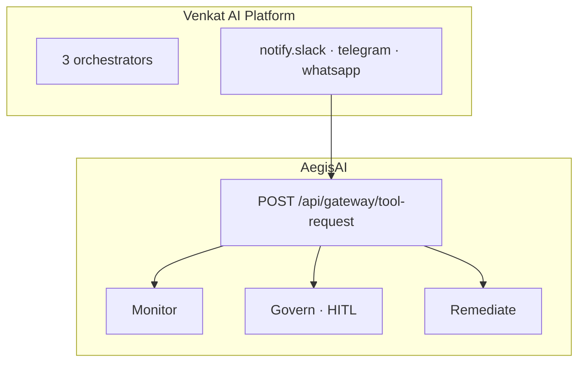

# Venkat AI Ecosystem — How the repos fit together

This document aligns **[AegisAI](https://github.com/vpeetla-ai/aegisai-enterprise-agent-platform)** (governance) with **[Venkat AI Platform (VAP)](https://github.com/vpeetla-ai/venkat-ai-platform)** (orchestration) and sibling projects.

---

## The two-question split

| Question | Repo | Role |
|----------|------|------|
| **What should agents do?** | [venkat-ai-platform](https://github.com/vpeetla-ai/venkat-ai-platform) | LangGraph orchestration — Chief routes intent, workers run in parallel, Critic reviews output |
| **What are agents allowed to do?** | [aegisai-enterprise-agent-platform](https://github.com/vpeetla-ai/aegisai-enterprise-agent-platform) | Governance control plane — AI Gateway, policy, HITL, signed audit, FinOps |



**Today:** VAP **notification delivery** is gateway-wrapped when `AEGISAI_API_BASE_URL` is set (`app/integrations/aegis_gateway.py`). Cron orchestrators and Website Build deploy broker path remain on the roadmap.

### VAP env (orchestration repo)

```bash
AEGISAI_API_BASE_URL=https://aegisai-api.onrender.com
AEGISAI_AGENT_ID=venkat-ai-platform
AEGISAI_TENANT_ID=bank-demo
AEGISAI_PRINCIPAL_ID=vap-orchestrator
AEGISAI_GATEWAY_ENABLED=true
AEGISAI_GATEWAY_FAIL_OPEN=true   # local dev without AegisAI running
```

---

## Full portfolio map

| Layer | Repository | Status |
|-------|------------|--------|
| **Governance** | [aegisai-enterprise-agent-platform](https://github.com/vpeetla-ai/aegisai-enterprise-agent-platform) | Production control plane + gateway |
| **Orchestration** | [venkat-ai-platform](https://github.com/vpeetla-ai/venkat-ai-platform) | Multi-agent OS reference |
| **Application** | [ai-content-factory](https://github.com/vpeetla-ai/ai-content-factory) | Content pipeline + HITL publish |
| **Knowledge** | [enterprise_rag_platform](https://github.com/vpeetla-ai/enterprise_rag_platform) | Governed RAG architecture |
| **Patterns** | [react-agent-pattern](https://github.com/vpeetla-ai/react-agent-pattern) (+ 4 siblings) | Tutorial implementations |

---

## AegisAI gateway coverage (honest matrix)

| Workload | Gateway intercept today | HITL on deploy |
|----------|-------------------------|----------------|
| **Website Build** orchestrator | Yes — deploy tools via `gateway_decision` | Yes |
| **External agents** (Python/TS SDK) | Yes — `POST /api/gateway/tool-request` | Policy-driven |
| **AI Content Pipeline** cron | No — managed run, LLM + notifications only | N/A |
| **Stock Research** cron | No — managed run, notifications only | N/A |
| **VAP** (venkat-ai-platform) | Yes — notify tools when `AEGISAI_API_BASE_URL` set | WhatsApp → HITL |

---

## Integration checklist (VAP → AegisAI)

1. Register agent: `POST /api/agent-registry/lifecycle` with `agent_id=venkat-ai-platform`
2. Install SDK: `sdk/python/aegisai_gateway/` or mirror pattern in VAP `services/`
3. Wrap side effects: `deliver_report` (Slack/Telegram/WhatsApp), future deploy tools
4. Set env: `AEGISAI_API_BASE_URL=https://aegisai-api.onrender.com`
5. Map Critic failures → `approval_required` for high-risk intents (`compliance`, `security_review`, `market_analysis`)

---

## Shared observability

Both repos use **Langfuse** (+ AegisAI also uses LangSmith). Target: shared `trace_id` / `workflow_run_id` in audit events for cross-repo lineage.

---

## Reading order for architects

1. [VAP Principal Design Doc](https://github.com/vpeetla-ai/venkat-ai-platform/blob/main/docs/PRINCIPAL_AI_ARCHITECT_DESIGN_DOCUMENT.md) — orchestration tradeoffs
2. [AegisAI North Star Architecture](https://github.com/vpeetla-ai/aegisai-enterprise-agent-platform/blob/main/platform/architecture/ARCHITECTURE.md) — governance contract
3. [Article: From Multi-Agent OS to Agent Governance](https://github.com/vpeetla-ai/ai-content-factory/blob/main/docs/content/from-multi-agent-os-to-agent-governance-substack.md)

---

Built by [Venkata Peetla](https://github.com/vpeetla-ai) · [venkat-ai.com](https://venkat-ai.com)
