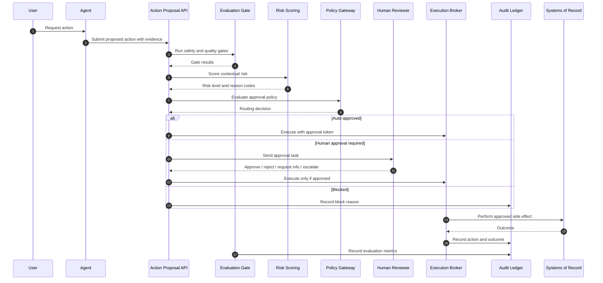
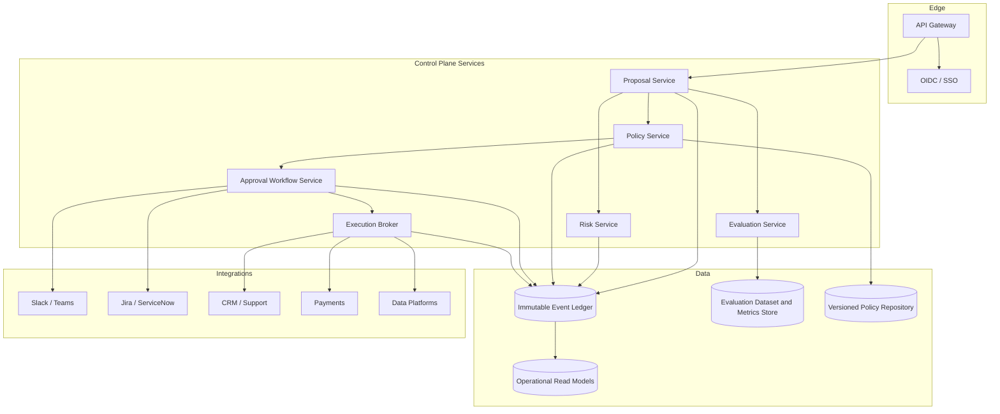

# Architecture

## System Context

The AegisAI Control Plane sits between AI agents and enterprise systems of record. Agents are allowed to propose actions, but they do not directly execute high-impact operations. The control plane decides whether an action is safe, compliant, approved, and measurable.

## Implementation Architecture

The codebase now follows a layered architecture so the portfolio reads like an enterprise platform instead of a script collection:

```text
aegisai/
  domain/                         # Business contracts and stable model language
  application/
    orchestration/                # Supervisor, LangGraph workflow, specialized agents
    guardrails/                   # Risk, eval, policy, decision engine
    knowledge/                    # RAG, vector memory, LLM gateway
    tools/                        # Governed agent tool registry
    execution/                    # Approved action broker
  infrastructure/
    persistence/                  # Control-plane state and audit adapters
  interfaces/
    http/                         # FastAPI API boundary
  observability/                  # Langfuse/LangSmith trace exporters
  product/                        # Agent registry, policy simulator, product-owner workflows
```

Design rules:

- Domain objects must not import FastAPI, SQLite, LangGraph, Langfuse, or LangSmith.
- Application services may use domain contracts but should depend on ports/adapters at boundaries.
- Infrastructure adapters own vendor-specific persistence details.
- Interface adapters translate external API payloads into application/domain requests.
- Observability is a side-channel. It must never block policy, HITL, or audit state.

## Core Components

### 1. Agent Runtime

Hosts task-specific agents such as refund agents, dispute agents, customer support agents, and operations agents. The runtime emits structured action proposals instead of directly mutating enterprise systems.

Responsibilities:

- Plan and reason over user intent.
- Retrieve context and prepare evidence.
- Generate proposed tool calls.
- Provide confidence, citations, rollback plan, and expected impact.

### 1.5 Agent Registry

Maintains the product-facing inventory of agents.

Captured fields:

- Agent owner and business domain.
- Allowed tools and data classes.
- Model/provider posture.
- Risk tier and autonomy level.
- Status, cost, incident count, and value metric.

The registry is the first control against agent sprawl.

### 2. Action Proposal API

Normalizes all agent requests into a canonical contract. This prevents each agent team from inventing its own approval format.

Captured fields:

- Tenant, user, agent, model, prompt, and tool identity.
- Action type, target system, amount, data classification, and reversibility.
- Evidence, rationale, confidence, expected outcome, and rollback strategy.
- Idempotency key and correlation ID.

### 3. Risk Scoring Service

Scores action risk using static and contextual signals.

Signals:

- Financial amount.
- Data sensitivity.
- Business criticality.
- Irreversibility.
- User/customer impact.
- Historical failure rate.
- Evaluation confidence.
- Policy domain.
- Regulatory exposure.

Risk levels:

- **Low:** safe to auto-approve if evaluation gates pass.
- **Medium:** human approval required.
- **High:** senior approver or domain expert required.
- **Critical:** block or require compliance approval and break-glass procedure.

### 4. Policy and Approval Gateway

Applies versioned policy-as-code to convert risk into routing decisions.

Routing outcomes:

- Auto-approve.
- Request human approval.
- Request additional information.
- Escalate to manager, expert, legal, security, or compliance.

### 4.5 Policy Simulator

Lets product, risk, and operations leaders preview routing outcomes before an agent action reaches production.

Outputs:

- Decision: auto-approve, human approval, escalate, or block.
- Risk score and level.
- Approval role.
- Evaluation pass/fail.
- Reason codes.
- Human-readable explanation.
- Block.

Policies account for role, tenant, region, workflow, tool, action class, amount, data classification, and current incident state.

### 5. Human Review Workspace

Approvers review a compact decision packet containing:

- Proposed action.
- Risk score and reason codes.
- Evaluation results.
- Evidence and retrieval citations.
- Before/after state preview.
- Customer/business impact.
- Policy that triggered the approval.
- Prior similar actions and outcomes.

Supported decisions:

- Approve.
- Reject.
- Request information.
- Escalate.
- Approve with conditions.

### 6. Execution Broker

The broker is the only component allowed to perform approved side effects. It validates approval tokens, checks idempotency, calls enterprise systems, and records outcomes.

Responsibilities:

- Enforce approval-before-execution.
- Use least-privilege service credentials.
- Guarantee idempotency for retries.
- Capture before/after state.
- Emit execution events.
- Trigger rollback workflows when supported.

### 7. Audit Ledger

Stores immutable, append-only events for proposals, risk scores, policy decisions, human decisions, execution results, evaluation outcomes, and feedback.

Design:

- Append-only event store.
- Hash chain or WORM-compatible storage for tamper evidence.
- Query-optimized read models for operations and audit export.
- Retention policy by tenant, workflow, and regulation.

### 8. Evaluation Layer

Measures quality before and after deployment.

Evaluation methods:

- Rule-based validation.
- LLM-as-judge.
- Retrieval precision and grounding checks.
- Semantic similarity for expected answer patterns.
- Golden dataset regression testing.
- Human evaluation for high-impact tasks.
- Online monitoring for drift, cost, latency, safety, and task success.

Evaluation outputs:

- Scores and metrics.
- Pass/fail gates.
- Error taxonomy.
- Drift alerts.
- Root-cause insights.
- Feedback for prompt, model, retrieval, tool, and policy improvements.

## End-to-End Flow



## Deployment Architecture



## Reliability Design

- Idempotency keys prevent duplicate executions after retries or approval resubmissions.
- Outbox pattern ensures audit events are not lost when side effects occur.
- Workflow state is persisted so approvals can resume from exact checkpoints.
- Dead-letter queues capture failed integrations for manual recovery.
- Circuit breakers stop execution when downstream enterprise systems degrade.
- Timeouts trigger escalation or safe cancellation depending on policy.

## Security Design

- OIDC SSO for human reviewers.
- RBAC for general reviewer permissions.
- ABAC for contextual approval authority by tenant, region, policy domain, and sensitivity.
- Service-to-service mTLS.
- Secrets managed in a vault.
- PII redaction in reviewer views unless the approver has a legitimate need.
- Tamper-evident audit storage.
- Model and prompt versions recorded for reproducibility.

## Scalability Design

- Proposal ingestion is stateless and horizontally scalable.
- Risk scoring is synchronous for low latency.
- Deep evaluations can run asynchronously unless policy marks them as blocking.
- Approval workflows use durable queues.
- Audit writes are append-only and partitioned by tenant and time.
- Read models are built from events for dashboards and auditor exports.
