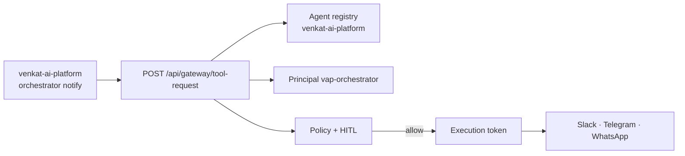

# AegisAI — North Star Architecture (Single Source of Truth)

> **Canonical reference** for product architecture, agent governance, orchestrators, gateway, deployment, and integrations.  
> **Deployment & API keys:** [`DEPLOYMENT-AND-SECRETS.md`](DEPLOYMENT-AND-SECRETS.md) · **Quick start:** [`docs/PRODUCT.md`](../docs/PRODUCT.md) · Business rules: [`business-rules.md`](business-rules.md)

---

## 1. Mission

**AegisAI is an Agent Governance Control Plane** — not an agent builder. Production agents (yours or third-party) connect through the **AI Gateway**, get monitored, governed, and remediated. The platform **onboards, restricts, and audits** live agent fleets.

**Pillars:** Monitor → Govern → Remediate (Rubrik-style visibility + Guild-style runtime authority)

---

## 2. North Star Diagram

```
┌─────────────────────────────────────────────────────────────────────────────┐
│                        PRODUCTION AGENT FLEET                                  │
│  ┌──────────────┐  ┌──────────────┐  ┌──────────────────────────────────┐   │
│  │ AI Content   │  │ Stock        │  │ Website Build (on-demand)        │   │
│  │ Pipeline     │  │ Research     │  │ Req → UI → FE → BE → Review      │   │
│  │ Mon/Thu cron │  │ 6AM EST cron │  │ LangGraph + real deploy tools    │   │
│  └──────┬───────┘  └──────┬───────┘  └──────────────┬───────────────────┘   │
│         │                 │                          │                        │
│         └─────────────────┴──────────────────────────┘                        │
│                                    │                                          │
│                         Side-effecting tool calls (gateway-integrated workloads) │
│                                    ▼                                          │
│  ┌─────────────────────────────────────────────────────────────────────────┐ │
│  │                         AI GATEWAY (runtime intercept)                   │ │
│  │  POST https://aegisai-api.onrender.com/api/gateway/tool-request        │ │
│  │  Identity · RBAC · Kill switch · Policy · HITL · Execution token       │ │
│  └─────────────────────────────────────────────────────────────────────────┘ │
│                                    │                                          │
│         ┌──────────────────────────┼──────────────────────────┐            │
│         ▼                          ▼                          ▼            │
│  ┌─────────────┐           ┌─────────────┐           ┌─────────────────┐    │
│  │  Monitor    │           │  Govern     │           │  Remediate      │    │
│  │  Lineage    │           │  Policy     │           │  Undo / freeze  │    │
│  │  FinOps     │           │  HITL queue │           │  Incident resp  │    │
│  └─────────────┘           └─────────────┘           └─────────────────┘    │
│                                                                               │
│  ┌─────────────────────────────────────────────────────────────────────────┐ │
│  │  CONTROL PLANE UI (Vercel) — Dashboard · Monitor · Governance ·        │ │
│  │  AI Gateway · Orchestrators · Onboard wizard · Website Build form        │ │
│  └─────────────────────────────────────────────────────────────────────────┘ │
└─────────────────────────────────────────────────────────────────────────────┘

Observability (parallel, non-authoritative): Langfuse + LangSmith traces per agent run
Notifications: Slack webhooks + Telegram bot for pipeline outputs
```

---

## 3. Layered Architecture

| Layer | Package / path | Responsibility |
| --- | --- | --- |
| **Experience** | `apps/web` | Next.js control plane UI |
| **Interfaces** | `services/api/.../interfaces/http` | FastAPI routes, auth, enforcement |
| **Product** | `services/api/.../product` | Registry, gateway, dashboard, Agent Cloud, FinOps |
| **Application** | `services/api/.../application` | LangGraph workflows, connectors, RAG, broker |
| **Domain** | `services/api/.../domain` | Proposals, decisions, risk, audit events |
| **Infrastructure** | `services/api/.../infrastructure` | Persistence, notifications |
| **Policy** | `platform/policy/aegisai.rego` | OPA rules (optional; default is builtin policy simulator) |
| **Database** | `platform/database/*.sql` | Postgres schema (Supabase in prod) |
| **Observability** | Langfuse + LangSmith env | Traces per orchestrator run (parallel, non-authoritative) |

> **North star vs today:** The diagram above is the target. **Website Build** and **SDK-registered agents** use the gateway today. Content and Stock cron orchestrators run managed pipelines without per-tool gateway intercept — see [Gateway coverage](#gateway-coverage-honest-matrix) below.

---

## 4. AI Gateway (production contract)

**Production URL:** `https://aegisai-api.onrender.com` (agents call directly — not via portfolio proxy)

### Flow

1. Agent requests tool → `POST /api/gateway/tool-request`
2. Gateway checks: kill switch → RBAC → policy simulation
3. Decision: `allow` | `approval_required` | `block` | `deny` | `frozen`
4. If `allow` → execution token issued
5. If `approval_required` → HITL task (in-app + Slack)
6. Broker executes with token → connector (Stripe, GitHub, Vercel, Render, …)
7. Audit event + signed packet

### SDKs

- **Python (installable):** `sdk/python/aegisai_gateway/`
- **TypeScript (in-repo reference):** `apps/web/lib/gateway/client.ts` — not published to npm

### Deploy tools — HITL at runtime

| Tool | Agent | Connector | Runtime HITL |
| --- | --- | --- | --- |
| `deploy.vercel_release` | `agent-fe-builder`, `agent-review-deploy` | Vercel API | ✅ `approval_required` |
| `deploy.render_release` | `agent-be-builder`, `agent-review-deploy` | Render API | ✅ `approval_required` |
| `github.create_pull_request` | `agent-review-deploy` | GitHub API | ✅ `approval_required` |
| `github.push_files` | `agent-fe-builder` | GitHub API | ✅ `approval_required` |

Policy (`aegisai.rego`) and the builtin gateway simulator **force `approval_required`** for `deploy_*` action types. OPA is optional when `OPA_URL` is set.

### Gateway coverage (honest matrix)

| Workload | Gateway intercept | Notes |
| --- | --- | --- |
| **Website Build** | ✅ Yes | Deploy tools via `gateway_decision` in LangGraph |
| **Python / TS SDK agents** | ✅ Yes | `POST /api/gateway/tool-request` |
| **Content pipeline cron** | ❌ No (yet) | Managed run → Slack/Telegram; no per-tool intercept |
| **Stock research cron** | ❌ No (yet) | Same pattern as content |
| **VAP (venkat-ai-platform)** | ✅ Yes | `notify.*` tools when `AEGISAI_API_BASE_URL` set on VAP |

---

## 5. Managed Orchestrators

| Orchestrator | Trigger | Schedule | Output |
| --- | --- | --- | --- |
| **AI Content Pipeline** | Render cron | Mon & Thu 07:00 UTC | Topic briefs → Slack + Telegram |
| **Stock Research** | Render cron | Weekdays 11:00 UTC (≈ 6AM EST) | Morning briefing → Slack + Telegram |
| **Website Build** | User submits requirement in UI | On-demand | LangGraph pipeline → GitHub + HITL-gated deploy |

### Website Build agents (LangGraph)

```
requirements_analyst → ui_design_analyst → fe_engineer → be_engineer → review_deploy
```

- **LangGraph** workflow with sequential fallback (`website_build_pipeline.py`)
- **LLM:** Gemini (free tier) or OpenAI via `AEGISAI_LLM_PROVIDER`
- **Traces:** Langfuse + LangSmith on every run
- **FE agent:** commits artifacts via GitHub; requests Vercel deploy through gateway
- **BE agent:** requests Render deploy through gateway
- **Review/deploy:** blocked until HITL approves deploy tools

### Content & Stock notifications

`NotificationDeliveryService` posts to:

- `SLACK_CONTENT_WEBHOOK_URL` / `SLACK_STOCK_WEBHOOK_URL`
- `TELEGRAM_BOT_TOKEN` + `TELEGRAM_CHAT_ID` (optional mirror)

---

## 6. Agent Onboarding Lifecycle

```
Register → Shadow → Pilot → Approved → (Restricted | Revoked | Deprecated)
```

**UI wizard** (`AgentOnboardingWizard`): register agent → assign owner/domain → tools + data classes → risk tier → promote status.

**API:**

- `POST /api/agent-registry/lifecycle` — register (auth required)
- `PATCH /api/agent-registry/lifecycle/{agent_id}/status` — promote/restrict/revoke
- `POST /api/platform/onboard-agent` — readiness checklist

**Registry storage:** in-memory today; gateway enforces lifecycle status, tool allowlists, shadow/restricted → HITL. Postgres `agent_registry` table migration planned.

### External orchestrator integration (VAP)



Pre-seeded fleet agent: `venkat-ai-platform` (pilot). Tools: `notify.slack`, `notify.telegram`, `notify.whatsapp`.

---

## 7. What we deliberately removed

| Removed | Reason |
| --- | --- |
| Refund **Demo** tab | Production agents + gateway test replace sales walkthrough |
| **Run workflow** button | Redundant with AI Gateway live intercept + orchestrators |

Governance proof comes from **live orchestrators** and **gateway coverage**, not a synthetic refund script.

---

## 8. Deployment Topology

```
Vercel (FE apps/web)  ──rewrites /api/*──►  Render (BE FastAPI)
                                              │
                                              ├──► Supabase Postgres
                                              ├──► Render cron → orchestrators
                                              └──► External: GitHub, Vercel, Slack, Telegram
```

| Service | Host | Config |
| --- | --- | --- |
| Frontend | Vercel | `apps/web`, `vercel.json` rewrites to Render |
| API | Render | `render.yaml`, Docker |
| DB | Supabase | `platform/database/postgres-migration.sql` |
| Content cron | Render | `0 7 * * 1,4` |
| Stock cron | Render | `0 11 * * 1-5` |

Portfolio embed: `venkat-ai-portfolio` → `/projects/aegisai` iframe.

---

## 9. Environment Variables (production)

### LLM (start free, swap later)

| Variable | Purpose |
| --- | --- |
| `AEGISAI_LLM_PROVIDER` | `gemini` (default prod) or `openai` |
| `GEMINI_API_KEY` | Google Gemini free tier |
| `OPENAI_API_KEY` | Optional OpenAI |

### Observability

| Variable | Purpose |
| --- | --- |
| `LANGFUSE_PUBLIC_KEY`, `LANGFUSE_SECRET_KEY`, `LANGFUSE_HOST` | Langfuse traces |
| `LANGSMITH_API_KEY`, `LANGSMITH_PROJECT` | LangSmith / LangGraph traces |

### Notifications

| Variable | Purpose |
| --- | --- |
| `SLACK_CONTENT_WEBHOOK_URL` | Content pipeline delivery |
| `SLACK_STOCK_WEBHOOK_URL` | Stock briefing delivery |
| `SLACK_APPROVAL_WEBHOOK_URL` | HITL approvals |
| `TELEGRAM_BOT_TOKEN`, `TELEGRAM_CHAT_ID` | Telegram mirror |

### Deploy connectors (Website Build)

| Variable | Purpose |
| --- | --- |
| `GITHUB_TOKEN`, `GITHUB_REPO_OWNER`, `GITHUB_REPO_NAME` | Commit generated artifacts |
| `VERCEL_TOKEN`, `VERCEL_PROJECT_ID` | Frontend deploy |
| `RENDER_API_KEY`, `RENDER_SERVICE_ID` | Backend deploy |

### Core platform

| Variable | Purpose |
| --- | --- |
| `DATABASE_URL` | Postgres (Render) |
| `AEGISAI_CORS_ORIGINS` | Vercel origin |
| `AEGISAI_PILOT_MODE`, `AEGISAI_REQUIRE_EXECUTION_TOKEN` | Production enforcement |

Full list: root `.env.example`

---

## 10. UI Map

| Screen | Purpose |
| --- | --- |
| **Dashboard** | Posture score, KPI tiles, pillar shortcuts |
| **Monitor** | Agent lineage, live activity |
| **Governance** | Policy violations, undo, control plane |
| **AI Gateway** | Connection status, coverage, live intercept test, SDKs |
| **Orchestrators** | Run content/stock; **Website Build** requirement form |
| **Onboard** | Agent registration wizard (shadow → approved) |

Design system: `apps/web/app/aegis-ui.css`

---

## 11. API Quick Reference

| Area | Routes |
| --- | --- |
| Gateway | `POST /api/gateway/tool-request` |
| Orchestrators | `GET/POST /api/orchestrators/*` |
| Registry | `GET/POST /api/agent-registry/lifecycle` |
| Agent Cloud | `GET /api/agent-cloud/{posture,monitor,govern}` |
| Dashboard | `GET /api/dashboard/summary` |
| Observability | `GET /api/observability/status` |
| Health | `GET /health` |

---

## 12. Ecosystem alignment

See **[docs/ECOSYSTEM.md](../../docs/ECOSYSTEM.md)** for how AegisAI pairs with:

- **[venkat-ai-platform](https://github.com/vpeetla-ai/venkat-ai-platform)** — orchestration layer (Chief, workers, Critic)
- **[ai-content-factory](https://github.com/vpeetla-ai/ai-content-factory)** — application pipeline with its own publish HITL
- **[enterprise_rag_platform](https://github.com/vpeetla-ai/enterprise_rag_platform)** — governed RAG reference

**Integration pattern:** register external orchestrators as `agent_id`, route side-effecting tools through `POST /api/gateway/tool-request`, consume HITL decisions in the control plane UI.

---

## 13. Evolution Roadmap

1. **Now:** LangGraph website pipeline, gateway on deploy tools, Slack/Telegram delivery, in-memory registry
2. **Next:** Postgres-backed registry, gateway intercept for Content/Stock tool calls, `github.push_files` through gateway, VAP SDK wiring
3. **Later:** Swap Gemini → enterprise LLM; MCP servers; multi-tenant onboarding

---

*Last updated: 2026-06-28 — honest gateway matrix, ecosystem map, registry status.*
