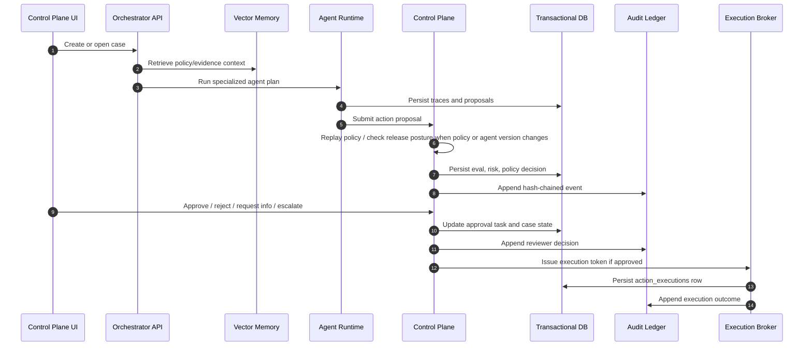

# End-to-End Enterprise Product Blueprint

## Product Boundary

This product is an enterprise AI operations platform with four connected planes:

1. **Multi-Agent Business Plane:** supervised orchestrator, specialized agents, shared case context, agent memory retrieval, and action proposals.
2. **Gateway Enforcement Plane:** SDKs, MCP proxy, sidecar adapters, identity checks, tool permissions, policy replay, execution tokens, and kill switches.
3. **AgentOps Control Plane:** evaluation gates, risk scoring, policy routing, HITL approvals, release promotion gates, assurance vault, and immutable audit.
4. **Data Plane:** transactional control-plane DB, vector/agent memory DB, enterprise-system connectors, observability, and audit/event storage.

## Backend Services

| Service | Responsibility | Persistence |
| --- | --- | --- |
| HTTP Interface | Accepts business request and exposes control-plane APIs | `aegisai.interfaces.http` |
| Orchestration Service | Selects agents, manages LangGraph state, emits trace/proposal context | `aegisai.application.orchestration` |
| Guardrails Service | Runs evaluation, risk, and policy decisioning | `aegisai.application.guardrails` |
| Knowledge Service | Retrieves policy, evidence, prior decisions, and domain knowledge | `aegisai.application.knowledge` |
| Execution Broker | Executes approved side effects with idempotency and rollback metadata | `aegisai.application.execution` |
| Product Services | Exposes registry lifecycle, simulator, replay, release gates, audit export, identity matrix, kill switch, and eval center | `aegisai.product` |
| Persistence Adapter | Stores workflow state and tamper-evident audit events | `aegisai.infrastructure.persistence` |
| Observability Service | Exports trace/eval/cost posture to Langfuse and LangSmith adapters | `aegisai.observability` |

## Databases

### Transactional Control-Plane DB

Use Postgres in production.

Core tables:

- `cases`
- `agent_traces`
- `action_proposals`
- `governance_decisions`
- `approval_tasks`
- `action_executions`
- `audit_events`

Production requirements:

- Row-level security by `tenant_id`.
- Point-in-time recovery.
- Read replicas for reporting.
- Strict migrations and backward-compatible schema changes.
- Encryption at rest.

### Vector / Agent Memory DB

Use pgvector, Pinecone, Weaviate, Milvus, or OpenSearch vector search depending on existing enterprise platform standards.

Core collections:

- Policy knowledge.
- Product and workflow documentation.
- Historical approved/rejected cases.
- Prior reviewer rationales.
- Tool usage examples.
- Customer communication templates.

Production requirements:

- Tenant-isolated namespaces.
- Source URI and document version tracking.
- Embedding model version tracking.
- PII redaction before indexing.
- Retrieval evaluation for precision, recall, grounding, and freshness.

## UI Actions

The UI must support real operator workflows:

- Select a case.
- Inspect agent plan, traces, memory hits, evidence, proposed action, eval gates, risk reasons, and policy version.
- Approve, reject, request info, or escalate.
- See the case state mutate immediately.
- Append an audit event for the reviewer action.
- Resume the workflow at the right agent when more information is requested.
- Issue an execution token only after approval.

The current product implements these portfolio-grade experience paths:

- Run individual sample use cases from the Experience Layer.
- Run all use cases and inspect decision, risk, reviewer role, traces, agents, evidence, LLM output, and exporter posture.
- Switch to AgentOps Observability to inspect trace health, eval posture, latency, cost, drift, audit, Langfuse, and LangSmith strategy.
- Use the hamburger menu for workspace navigation, metrics refresh, exporter status, and batch scenario runs.
- Execute an approval-gated action through `/api/execution/execute` and inspect connector, external reference, rollback reference, and audit validity.
- Load the Agent Registry from `/api/agent-registry` to inspect owners, allowed tools, data classes, autonomy levels, and risk.
- Run Policy Simulator scenarios through `/api/policy/simulate` to explain what a policy would do before execution.
- Export audit packets through `/api/audit-packets/{tenant_id}/{case_id}.json` and `.pdf`.
- Inspect reviewer/tool identity posture through `/api/identity/posture`.
- Activate incident controls through `/api/kill-switches`.
- Run golden release gates through `/api/evaluations/golden/run`.
- Inspect gateway SDK adoption contracts through `/api/platform/gateway-sdks`.
- Replay candidate policies against historical agent decisions through `/api/policy/replay`.
- Register and promote agents through `/api/agent-registry/lifecycle`.
- Inspect agent-to-tool permissions through `/api/identity/permission-matrix`.
- Gate prompt/model/retrieval/tool releases through `/api/release-gates/promote`.
- Review incident freeze/unfreeze operations through `/api/incidents/timeline`.
- Compare local, low-cost cloud, and AWS deployment paths through `/api/platform/deployment-posture`.
- Run the flagship buyer demo script through `/api/demo/flagship-flow`.

## Product Owner Acceptance Criteria

An enterprise reviewer should be able to answer these questions from the UI without reading code:

- What business request was submitted?
- Which business rule fired?
- Which agents ran and why?
- What evidence was retrieved?
- Did the action auto-approve, escalate, or block?
- What human role is accountable?
- What was written to audit?
- Are observability exporters configured?
- Did the approved action execute, pause for approval, or block?
- Is there an external connector reference and rollback reference where applicable?
- What remains demo-only versus production-ready?

## Production Event Flow

## Production Readiness Architecture Additions

The current implementation adds the next layer needed for enterprise credibility:

- **Real gateway adoption story:** Python, TypeScript, and MCP proxy SDK contracts.
- **Historical policy replay:** policy changes are dry-run against prior agent decisions before promotion.
- **Agent lifecycle system:** agents move through shadow, pilot, restricted, approved, revoked, and deprecated states.
- **Permission matrix:** every agent-to-tool relationship is visible as read, request-only, execute-through-gateway, or blocked.
- **Release governance:** prompt, model, retrieval, and tool changes must pass gates before production.
- **Incident operations:** freeze, investigate, remediate, and unfreeze paths are explicit.
- **Deployment posture:** local demo, low-cost cloud, and AWS enterprise deployment tracks are separated.
- **Flagship demo:** regulated customer operations proves the product in one buyer-understandable workflow.
