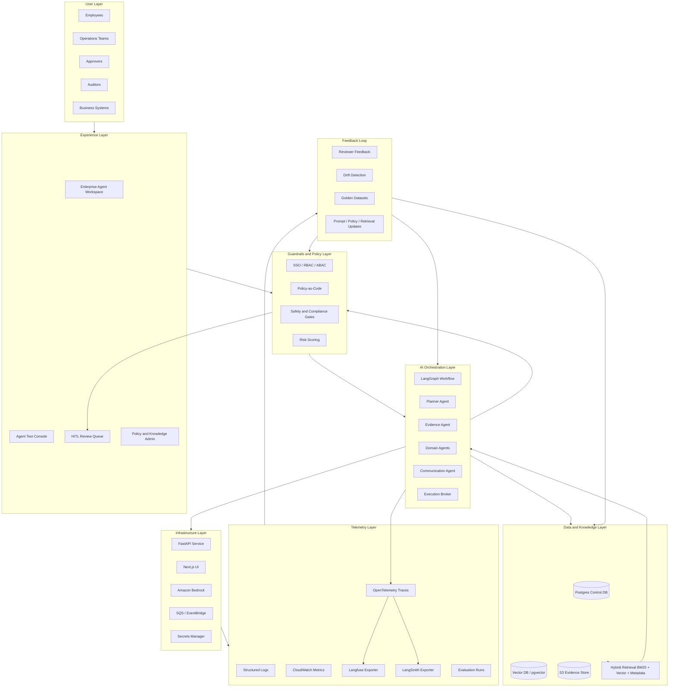

# AegisAI Enterprise AI Production Architecture

## Product Name

**AegisAI Agent Governance Control Plane**

## Principal Architect Positioning

AegisAI is an enterprise AI production platform, not a demo chatbot. The architecture separates the user experience, agent orchestration, guardrails, knowledge, persistence, observability, and human-accountability planes so each can evolve independently under enterprise controls.

The current implementation follows a layered backend code structure:

| Runtime Layer | Package | Production Responsibility |
| --- | --- | --- |
| Domain | `aegisai.domain` | Stable contracts for actions, risk, evaluations, governance decisions, traces, and audit events |
| Orchestration | `aegisai.application.orchestration` | LangGraph workflow, multi-agent supervisor, specialized agents, shared case context |
| Guardrails | `aegisai.application.guardrails` | Risk scoring, evaluation gates, policy routing, approval/block decisions |
| Knowledge | `aegisai.application.knowledge` | RAG, vector memory, LLM gateway, source-grounded evidence |
| Execution | `aegisai.application.execution` | Approval-gated side-effect broker, connector routing, idempotency, rollback metadata |
| Product | `aegisai.product` | Agent registry, policy simulator, audit export, identity/RBAC, kill switch, golden evals |
| Persistence | `aegisai.infrastructure.persistence` | Cases, proposals, traces, decisions, approvals, hash-chained audit |
| Interfaces | `aegisai.interfaces.http` | FastAPI boundary for workspace, control plane, RAG, reviewer, observability APIs |
| Observability | `aegisai.observability` | Vendor-neutral trace service with optional Langfuse and LangSmith exporters |

`aegisai.api` remains as the stable FastAPI entrypoint. New production work should land in the bounded contexts above.

## Architecture Principle

A production AI system is not just an LLM call. It is an end-to-end operating model across experience, guardrails, orchestration, knowledge, infrastructure, telemetry, feedback, and human accountability.

## Layered Architecture

## Experience Layer Best Cases

The UI should support real enterprise operator workflows:

- **Agent Workspace:** submit business requests, inspect agent plan, memory hits, evidence, and proposed action.
- **Agent Registry:** inspect every agent's owner, tools, data classes, autonomy level, risk tier, cost, and incidents.
- **Policy Simulator:** preview auto-approve, human review, escalation, or block outcomes before production rollout.
- **Control-Plane Review Queue:** approve, reject, request info, or escalate with reason codes.
- **Policy Simulator:** preview what policy version would do before deploying changes.
- **RAG Inspector:** show vector hits, keyword hits, metadata filters, freshness, and source URIs.
- **Evaluation Console:** compare prompt/model/retrieval versions against golden datasets.
- **Audit Explorer:** export case timeline, reviewer decisions, policy version, model version, and execution outcome.
- **Operations View:** latency, cost, failed tool calls, drift, reviewer SLA, and auto-approval rate.

## Startup Problem Coverage

| Market Pain | AegisAI Capability |
| --- | --- |
| Agent sprawl | Agent Registry with owner, risk, autonomy, tool access, cost, and incidents |
| Identity sprawl | Agent Identity + RBAC for reviewer roles and tool execution identities |
| Tool sprawl | Governed tool registry, approval-gated execution broker, kill switch |
| Audit gaps | JSON/PDF audit packets and hash-chained audit events |
| Unmanaged cost | Agent cost posture and golden eval gates before release promotion |

## Hybrid Retrieval Pattern

Production retrieval should combine:

- Vector similarity for semantic match.
- BM25/keyword search for exact policy and legal phrase matching.
- Metadata filters for tenant, jurisdiction, data classification, and policy version.
- Recency and authority ranking for stale-document control.
- Human-approved source promotion for high-risk workflows.

## HITL Pattern

HITL is not a generic approval button. A reviewer packet must include:

- Proposed action.
- Risk score and reason codes.
- Evaluation gate results.
- Retrieved evidence and source URIs.
- Policy version.
- Before/after state preview.
- Rollback plan.
- Agent trace and prompt/model versions.

## Approved Action Execution Pattern

The execution broker completes the product loop:

1. Agent proposes an action.
2. Guardrails decide auto-approve, human review, escalate, or block.
3. Reviewer approves when required.
4. Execution broker validates persisted proposal, decision, approval status, idempotency key, connector allowlist, and reversibility.
5. Broker calls the target connector or returns a blocked/requires-approval result.
6. Execution outcome, external reference, rollback reference, and audit event are persisted.

Execution is intentionally outside the agent classes. Agents can propose side effects, but only the control-plane execution layer can perform them.
