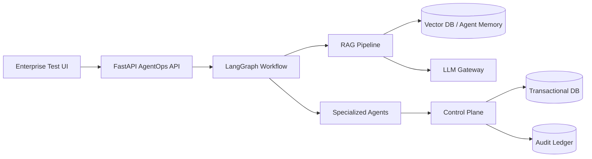

# LLM + LangGraph + RAG + FastAPI Product Layer

## Why This Layer Matters

The enterprise product needs more than agents as Python classes. It needs a testable runtime surface:

- LLM provider abstraction.
- LangGraph workflow orchestration.
- RAG pipeline with vector-memory retrieval.
- FastAPI endpoints for UI and automated testing.
- UV-based dependency workflow.
- Local deterministic fallback for portfolio demos without API keys.

## Runtime Architecture

Current package ownership:

| Capability | Package |
| --- | --- |
| FastAPI endpoints | `aegisai.interfaces.http` |
| LangGraph workflow | `aegisai.application.orchestration` |
| Specialized agents | `aegisai.application.orchestration.multi_agent` |
| RAG and vector memory | `aegisai.application.knowledge` |
| Governed tool registry | `aegisai.application.tools` |
| Risk/eval/policy | `aegisai.application.guardrails` |
| Control-plane DB | `aegisai.infrastructure.persistence` |
| Langfuse/LangSmith exporters | `aegisai.observability` |



## Local Development With UV

Install `uv` if needed:

```bash
python3 -m pip install uv
```

Create and sync the environment:

```bash
uv venv
uv pip install -r requirements.txt
```

Run tests:

```bash
PYTHONPATH=services/api/src uv run python -m unittest discover -s services/api/tests
```

Run the FastAPI backend:

```bash
PYTHONPATH=services/api/src uv run python -m uvicorn aegisai.api:app --reload --host 0.0.0.0 --port 8000
```

Open API docs:

```text
http://localhost:8000/docs
```

## Core API Endpoints

| Method | Path | Purpose |
| --- | --- | --- |
| GET | `/health` | Service, memory, and audit-chain health |
| POST | `/api/agents/run` | Run RAG + LangGraph + specialized agents + control plane |
| POST | `/api/rag/search` | Test vector DB retrieval directly |
| POST | `/api/control-plane/reviewer-action` | Approve, reject, request info, or escalate |
| POST | `/api/execution/execute` | Execute approved or auto-approved side effects through the broker |
| GET | `/api/control-plane/metrics` | Control-plane DB and memory counts |
| GET | `/api/observability/status` | Langfuse/LangSmith exporter posture |

## Production LLM Options

The `LLMGateway` supports:

- `AEGISAI_LLM_PROVIDER=local` for deterministic offline portfolio demos.
- `AEGISAI_LLM_PROVIDER=openai` with `OPENAI_API_KEY` for OpenAI Responses API calls.
- Future adapters for Azure OpenAI, Amazon Bedrock, Vertex AI, or self-hosted vLLM.

OpenAI mode uses `POST /v1/responses` with `instructions` and `input`, then returns provider, model, content, and confidence through the internal `LLMResponse` contract. OpenAI's Responses API is the current interface for model responses and supports text generation plus tool-capable workflows.

Environment:

```bash
AEGISAI_LLM_PROVIDER=openai
AEGISAI_LLM_MODEL=gpt-4.1-mini
OPENAI_API_KEY=...
OPENAI_BASE_URL=https://api.openai.com/v1
```

## Agent Tools

Multi-agent systems need tools, but enterprise tools need governance. AegisAI separates tool proposal from tool execution:

- `rag.search_policy_memory`: non-side-effecting retrieval tool used by evidence and RAG paths.
- `payments.issue_refund`: side-effecting payment tool, executed only by the approved action broker.
- `privacy.modify_or_delete_data`: side-effecting data tool, blocked or approval-gated.
- `infra.change_production_configuration`: side-effecting infrastructure tool with rollback metadata.

The tool registry lives in `aegisai.application.tools`. Agents can propose side-effecting actions, but only `aegisai.application.execution` can execute approved actions.

## Production Vector DB Options

The local implementation uses SQLite with deterministic embeddings for portable demos. Production choices:

- Postgres + pgvector when the team wants fewer moving parts.
- Pinecone for managed high-scale vector search.
- Weaviate or Milvus for open-source vector infrastructure.
- OpenSearch vector search if the enterprise already operates OpenSearch.
