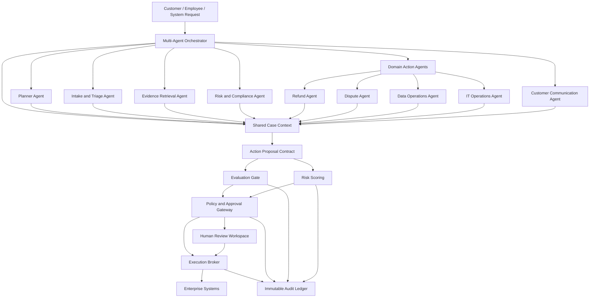
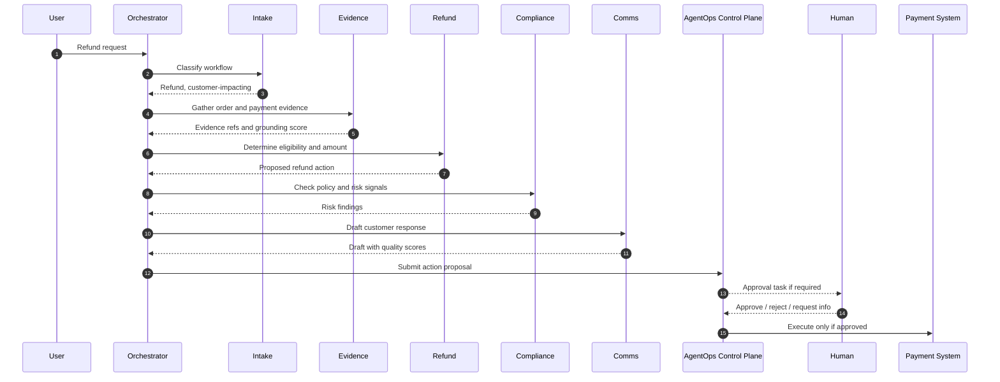

# Multi-Agent Architecture

## Principal Architect Recommendation

The strongest portfolio version is not just "an agent with approvals." It is an enterprise **multi-agent operating layer** governed by the AegisAI Control Plane.

The layered model is:

1. **Business Request Layer:** user or system asks for an outcome.
2. **Multi-Agent Operating Layer:** orchestrator decomposes the task, assigns specialized agents, manages shared context, and creates action proposals.
3. **AgentOps Control Plane:** evaluates quality, scores risk, applies policy, routes HITL approvals, authorizes execution, and records audit events.
4. **Enterprise Systems Layer:** CRM, payments, document systems, data platforms, IAM, ticketing, and messaging.
5. **Learning Layer:** evaluation results and human decisions improve prompts, retrieval, tools, business rules, and policies.

## Architecture

Implementation mapping:

- `aegisai.application.orchestration.multi_agent` owns the supervised agent runtime and specialized agents.
- `aegisai.application.orchestration.langgraph_workflow` wraps the runtime in a LangGraph-compatible state graph.
- `aegisai.domain` owns the shared contracts used by agents, guardrails, persistence, and observability.
- `aegisai.application.guardrails` owns risk, eval, and policy decisions after agents propose action.
- `aegisai.observability` exports agent run posture to Langfuse/LangSmith without giving those tools execution authority.

## Specialized Agents

### 1. Planner Agent

Owns decomposition and sequencing.

Responsibilities:

- Convert business intent into a task plan.
- Select agents based on domain, risk, and missing evidence.
- Define completion criteria.
- Stop the workflow if prerequisites are not met.

Business rules:

- Must not propose side effects directly.
- Must include at least one evidence step for regulated workflows.
- Must route all side-effecting actions through the control plane.

### 2. Intake and Triage Agent

Owns request classification.

Responsibilities:

- Identify workflow type: refund, dispute, data request, customer message, operational change.
- Detect urgency, customer impact, and regulatory sensitivity.
- Normalize the request into a case record.

Business rules:

- If intent is ambiguous, request clarification before action.
- If sensitive data is detected, mark the case confidential or restricted.
- If request mentions legal, fraud, complaint, or regulator, require compliance review.

### 3. Evidence Retrieval Agent

Owns evidence gathering and grounding.

Responsibilities:

- Retrieve order history, payment records, policy docs, CRM notes, prior approvals, and relevant customer messages.
- Produce citations and confidence scores.
- Identify evidence gaps.

Business rules:

- No action proposal can execute without evidence references.
- Evidence older than the configured freshness window must be marked stale.
- Restricted evidence is redacted in reviewer packets unless access is justified.

### 4. Risk and Compliance Agent

Owns pre-policy compliance reasoning.

Responsibilities:

- Identify data sensitivity, reversibility, regulatory concerns, and required approver roles.
- Produce risk reason codes.
- Recommend policy exceptions or blocks.

Business rules:

- High-value financial actions require senior review.
- Irreversible restricted-data actions require compliance approval or block.
- Customer-impacting decisions require explanation quality checks.

### 5. Refund Agent

Owns refund and cancellation workflows.

Responsibilities:

- Determine refund eligibility.
- Calculate proposed refund amount.
- Propose payment-system action.
- Prepare rollback or reconciliation notes.

Business rules:

- Refunds below $100 with low risk may auto-approve.
- Refunds from $100 to $1,000 require standard workflow-owner approval if customer-impacting.
- Refunds above $1,000 require human approval.
- Refunds above $10,000 require senior approval.
- Refunds with fraud indicators are blocked pending investigation.

### 6. Payment Dispute Agent

Owns dispute evidence and chargeback workflows.

Responsibilities:

- Summarize dispute reason.
- Gather transaction evidence.
- Draft dispute response.
- Propose submission to payment processor.

Business rules:

- Must include transaction evidence and policy citation.
- Cannot submit if evidence confidence is below threshold.
- Legal or regulatory disputes require escalation.

### 7. Data Operations Agent

Owns data modification, deletion, export, and access workflows.

Responsibilities:

- Validate identity and entitlement.
- Identify affected systems and records.
- Propose data operation plan.
- Produce before/after impact summary.

Business rules:

- Restricted data operations are never auto-approved.
- Irreversible deletion requires dual approval.
- Data export requires purpose, recipient, retention period, and masking review.

### 8. Customer Communication Agent

Owns messages sent to customers.

Responsibilities:

- Draft customer-facing language.
- Check tone, factuality, policy compliance, and required disclaimers.
- Generate reviewer-ready summary.

Business rules:

- Must not promise outcomes that have not been approved.
- Must use approved templates for regulated topics.
- Must pass tone, safety, and policy-compliance evaluation gates.

### 9. IT Operations Agent

Owns deployments, access grants, config changes, and operational actions.

Responsibilities:

- Prepare change plan.
- Estimate blast radius.
- Identify rollback plan.
- Propose execution windows.

Business rules:

- Production changes require change-ticket linkage.
- Identity and access changes require least-privilege validation.
- Critical production changes require senior approval and rollback confirmation.

## Shared Case Context

Shared context is not a loose chat transcript. It is a governed case memory with typed sections:

- Request metadata.
- User and tenant identity.
- Workflow classification.
- Evidence references.
- Policy findings.
- Agent notes.
- Proposed actions.
- Evaluation results.
- Governance decisions.
- Human feedback.
- Execution outcomes.

Design principles:

- Agents can read the shared context but can write only to their owned section.
- Side-effecting action proposals must use the canonical proposal contract.
- Context updates are evented for audit and replay.
- Sensitive fields are classified and masked based on viewer permission.

## Orchestration Pattern

This project uses a **supervised orchestrator** pattern rather than fully decentralized agent negotiation.

Why:

- Enterprise workflows need predictable control points.
- Reviewers and auditors need a clear chain of responsibility.
- The orchestrator can enforce task budgets, stop conditions, evidence requirements, and handoff contracts.
- Specialized agents remain focused and easier to evaluate.

## Example Refund Flow

