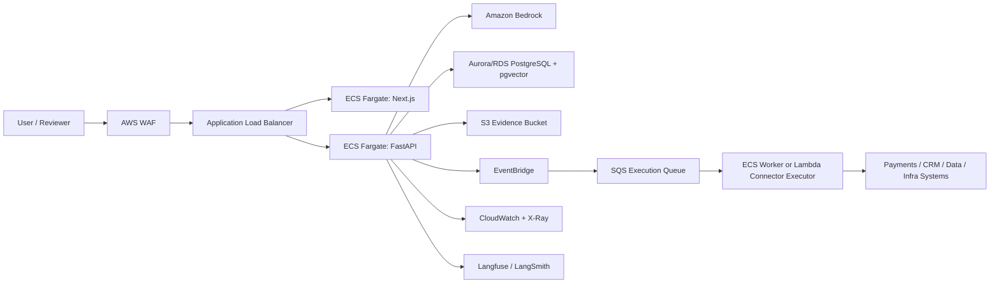

# AWS E2E Deployment Runbook

## Principal Architecture Decision

Deploy AegisAI as a containerized enterprise AI platform on AWS:

- **Frontend:** Next.js control room on ECS Fargate behind an Application Load Balancer, or Amplify Hosting for a lower-ops portfolio demo.
- **API:** FastAPI service on ECS Fargate.
- **Orchestration:** LangGraph runs inside the API task for the portfolio version; extract to workers when throughput grows.
- **LLM:** Amazon Bedrock for managed foundation models.
- **Control-plane DB:** Amazon Aurora PostgreSQL or RDS PostgreSQL.
- **Vector DB:** pgvector on Aurora/RDS for the cost-conscious first production version; OpenSearch Serverless only when advanced semantic search, filtering, and high-scale vector workloads justify the baseline cost.
- **Async execution:** EventBridge + SQS for action execution, retries, and dead-letter handling.
- **Secrets:** AWS Secrets Manager.
- **Telemetry:** CloudWatch Logs/Metrics, AWS X-Ray/OpenTelemetry, Langfuse/LangSmith adapters.
- **Security edge:** AWS WAF + ALB + Cognito or enterprise IdP through OIDC/SAML.

Official pricing references to validate before deploying:

- AWS Fargate pricing: https://aws.amazon.com/fargate/pricing/
- Amazon Bedrock pricing: https://aws.amazon.com/bedrock/pricing/
- Amazon RDS pricing: https://aws.amazon.com/rds/pricing/
- Amazon OpenSearch pricing: https://aws.amazon.com/opensearch-service/pricing/

## What Deploys Where

| Platform Layer | AWS Service | What Runs There |
| --- | --- | --- |
| User layer | Amazon Cognito or enterprise OIDC | Users, reviewers, admins, service roles |
| Experience layer | ECS Fargate web task or Amplify Hosting | Next.js AegisAI workspace and AgentOps control plane |
| Guardrails + policy layer | FastAPI task + policy tables in Postgres | Risk scoring, eval gates, HITL routing, approval rules |
| AI orchestration layer | FastAPI task first; ECS worker later | LangGraph workflow, specialized agents, shared context |
| Data + knowledge layer | Aurora/RDS Postgres + pgvector, S3 | Cases, approvals, traces, audit, documents, vector memory |
| Hybrid retrieval | pgvector + keyword indexes; optional OpenSearch | Policy lookup, prior decisions, evidence retrieval |
| Infrastructure layer | VPC, ECS, ECR, ALB, NAT or VPC endpoints | Container runtime and private networking |
| Telemetry layer | CloudWatch, X-Ray/OTel, Langfuse/LangSmith | Logs, metrics, traces, eval/cost attribution |
| Feedback loop | Postgres, S3, scheduled ECS task | Eval datasets, reviewer feedback, drift reports |
| HITL | AegisAI UI + Postgres + EventBridge | Approval tasks, escalation, decision audit |
| Approved execution | EventBridge + SQS + ECS worker/Lambda | Connector calls, idempotency, retries, rollback metadata |

## Recommended Deployment Topology



## Deployment Environments

### Portfolio Demo, Lowest Operational Burden

- Frontend: Amplify Hosting or ECS single web task.
- API: one ECS Fargate task, 0.5 vCPU / 1 GB memory.
- DB: small RDS PostgreSQL instance, single-AZ.
- Vector: pgvector in the same Postgres database.
- Bedrock: on-demand model calls with tight request limits.
- Observability: CloudWatch + optional hosted LangSmith/Langfuse.

This is the best starting point for a personal portfolio because it shows real enterprise architecture without paying for idle enterprise scale.

### Production Pilot

- Frontend: ECS service with 2 tasks across two AZs.
- API: ECS service with 2 to 4 tasks and autoscaling.
- DB: Aurora PostgreSQL, Multi-AZ, backups, Performance Insights.
- Vector: pgvector first; OpenSearch Serverless only if retrieval scale requires it.
- Execution: EventBridge + SQS + worker service, DLQ, retry policies.
- Security: Cognito or OIDC, WAF, Secrets Manager, private subnets, VPC endpoints for ECR/S3/CloudWatch/Secrets.
- Observability: CloudWatch dashboards, X-Ray/OTel traces, Langfuse/LangSmith exporters.

## E2E Deployment Steps

1. **Create AWS account guardrails**
   - Enable MFA.
   - Create an IAM deployment role.
   - Add AWS Budgets with alerts for Bedrock, ECS, RDS, NAT Gateway, and OpenSearch.
   - Request Bedrock model access in the target region.

2. **Create networking**
   - VPC across two Availability Zones.
   - Public subnets for ALB.
   - Private subnets for ECS tasks and RDS.
   - Prefer VPC endpoints for ECR, S3, CloudWatch Logs, Secrets Manager, and Bedrock runtime where available.
   - Use NAT Gateway only when private tasks need public internet egress; for portfolio demos, this can become a meaningful fixed cost.

3. **Create container registries**
   - ECR repo: `aegisai-api`.
   - ECR repo: `aegisai-web`.
   - Build from repo root:
     ```bash
     docker build -f services/api/Dockerfile -t aegisai-api .
     docker build -f apps/web/Dockerfile --build-arg NEXT_PUBLIC_API_BASE_URL=https://api.your-domain.com -t aegisai-web .
     ```

4. **Provision data stores**
   - Create Aurora/RDS PostgreSQL.
   - Enable `pgvector` when using Postgres for retrieval memory.
   - Apply [db-schema.sql](../database/db-schema.sql).
   - Create an S3 bucket for evidence packets, eval datasets, and exported traces.

5. **Configure secrets and environment**
   - Store DB credentials in Secrets Manager.
   - Store Langfuse/LangSmith keys if enabled.
   - Configure API task env:
     - `AEGISAI_CORS_ORIGINS=https://app.your-domain.com`
     - `LANGFUSE_PUBLIC_KEY`, `LANGFUSE_SECRET_KEY`, `LANGFUSE_HOST`
     - `LANGSMITH_API_KEY`, `LANGSMITH_PROJECT`
   - Configure web build env:
     - `NEXT_PUBLIC_API_BASE_URL=https://api.your-domain.com`

6. **Deploy API service**
   - ECS task definition: API container port `8000`.
   - Health check path: `/health`.
   - IAM permissions:
     - Bedrock invoke model.
     - Read Secrets Manager DB secret.
     - Write CloudWatch logs.
     - Read/write S3 evidence bucket.
     - Publish EventBridge execution events.
   - Attach to private subnets.
   - Register with ALB target group.

7. **Deploy web service**
   - ECS task definition: web container port `3000`.
   - Web container uses Next.js `output: "standalone"` and starts with `node server.js`.
   - ALB route `/` to web.
   - ALB route `/api/*` can either proxy to API or the frontend can call a separate API domain.
   - Set `NEXT_PUBLIC_API_BASE_URL` during image build for the API domain exposed to browser users.
   - Add ACM certificate and Route 53 DNS.

8. **Deploy execution worker**
   - For portfolio version, the synchronous `/api/execution/execute` endpoint is enough.
   - For production, emit `execution.requested` to EventBridge and process with an ECS worker or Lambda.
   - Worker must enforce:
     - approval status
     - idempotency key
     - connector allowlist
     - tenant credential boundary
     - rollback handle where supported
     - audit event write after every attempt

9. **Set up observability**
   - CloudWatch log groups for API, web, worker.
   - CloudWatch dashboard for request count, latency, errors, approvals, executions, eval failures, Bedrock cost.
   - X-Ray or OpenTelemetry collector for distributed traces.
   - Optional Langfuse/LangSmith exporters for LLM traces, prompts, evals, and datasets.

10. **Run smoke tests**
   - `GET /health`
   - `POST /api/agents/run`
   - `POST /api/control-plane/reviewer-action`
   - `POST /api/execution/execute`
   - `GET /api/control-plane/metrics`
   - Verify audit chain remains valid.

## Cost Guidance

Use the AWS Pricing Calculator before deployment. The rough cost shape is:

- **Fargate:** charged by vCPU, memory, OS/architecture, ephemeral storage, and running duration.
- **Bedrock:** driven by model choice, input/output tokens, embeddings, and batch vs on-demand mode.
- **RDS/Aurora:** driven by instance or ACU capacity, storage, I/O, backups, and Multi-AZ.
- **OpenSearch Serverless:** powerful but can be expensive for idle portfolio environments; avoid until pgvector is insufficient.
- **NAT Gateway:** often a surprising fixed cost in small demos; prefer VPC endpoints or public-subnet demo tasks if acceptable.
- **CloudWatch:** logs, metrics, and trace volume can grow; set retention policies.

Principal recommendation: for your portfolio, deploy **ECS Fargate + RDS PostgreSQL/pgvector + Bedrock + CloudWatch**, and keep OpenSearch Serverless out of the first deployment. This gives the strongest enterprise story per dollar.
