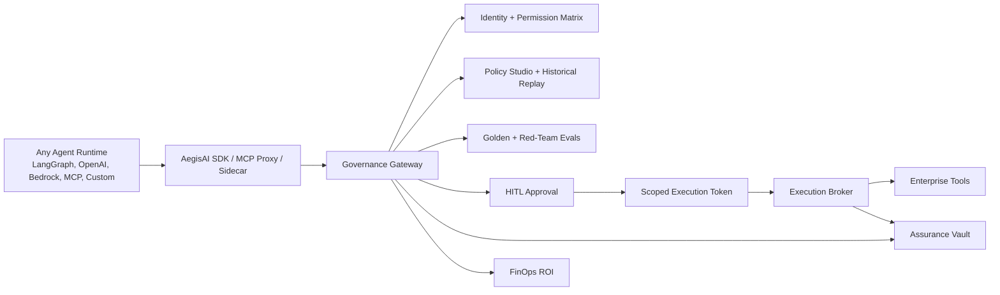

# AegisAI Production Readiness Demo Playbook

## Demo Thesis

AegisAI is not another agent builder. It is the runtime governance gateway enterprises place between any AI agent and production systems.

The demo must prove one thing clearly:

> Unsafe agent actions are stopped before production impact, and every allow, block, approval, execution, cost, and audit decision is explainable.

## Primary Buyer Demo

Use the regulated customer-operations scenario.

1. Customer requests a $2,500 refund.
2. Agent retrieves policy context from governed memory.
3. AegisAI intercepts the refund tool call.
4. Gateway checks agent identity, tool scope, policy, evals, and kill switches.
5. Policy requires human approval.
6. Reviewer approves and a scoped execution token is issued.
7. Execution broker performs the side effect.
8. Signed audit packet proves who approved what, why, and what executed.
9. FinOps shows review minutes saved, cost per workflow, and estimated loss prevented.

## UI Walkthrough

1. Open the main **Agent Governance Control Plane** screen.
2. Use the visible top navigation only:
   - **Buyer Demo** for the golden governed workflow.
   - **Platform Console** for operator and architect controls.
   - **Proof Workloads** for reference agent scenarios.
   - **Run Workflow**, **Posture**, and **Test Gateway** as direct operational actions.
   - There is intentionally no hamburger menu; every primary action is visible.
3. Read the first-screen **Buyer Proof Brief**:
   - Problem: agent sprawl is becoming uncontrolled tool authority.
   - Product thesis: AegisAI is the control plane above any agent framework.
   - Demo promise: every CTA proves one buyer-critical control.
   - Success signal: unsafe autonomy is blocked without slowing safe work.
4. Follow the **UX Storyline** rail:
   - Command: know the risk posture.
   - Prove: run the governed workflow.
   - Harden: make agents production-ready.
   - Explain: show buyer-facing controls.
   - Integrate: wire real enterprise systems.
5. Click **Run Governed Workflow**.
6. Confirm the guided buyer demo marks each stage complete:
   - Gateway coverage
   - Connector catalog
   - Governance gateway
   - Human approval
   - Broker execution
   - Signed audit
7. Open **3. Production Readiness Center** and walk the buyer through:
   - Adopt: Gateway SDKs and registry lifecycle
   - Govern: Historical policy replay and permission matrix
   - Release: Promotion gate for prompt, model, retrieval, and tool changes
   - Operate: Incident timeline and deployment posture
   - Prove: Flagship demo flow
8. Open **4. Governance Story Modules** and show:
   - Gateway story
   - Developer quickstart
   - Regulated ops scenario
   - Policy Studio
   - Identity graph
   - Assurance Vault

## Implementation Status (P0/P1/P2)

### Implemented now

- Buyer-first and Platform mode toggle in top navigation (buyer is default).
- Buyer-mode health gate to block stale or down API and provide recheck action.
- Buyer-mode auto-bootstrap when API is healthy:
  - Prefetches key buyer modules.
  - Auto-runs the flagship guided buyer demo flow.
- Guided buyer narrative includes persona chips, north-star KPI, flagship proof flow, and pilot success footer.
- Policy replay diff, identity graph visualization, gateway SDK snippet, and design partner checklist are integrated.
- Connector registration wizard is wired into the architect console.
- Governance story cards use refresh-oriented labels (for repeat demos).
- Toast notifications are wired globally, including MCP proxy success/failure feedback.
- Observability export panel for Langfuse/LangSmith adapter posture is wired in platform mode.
- P2 UX polish shipped (skeletons, toast stack, responsive buyer layouts, reduced-motion handling).

### Demo operator runbook (required before live demo)

1. Restart API to avoid stale route process:
   - `AEGISAI_FORCE_RESTART=1 ./scripts/start-api.sh`
2. Start frontend:
   - `npm -C "apps/web" run dev`
3. Hard refresh browser tab after both are healthy.
4. Confirm buyer mode loads and guided steps progress automatically.

## API Proof Points

| Product question | Endpoint |
| --- | --- |
| How does any agent integrate? | `GET /api/platform/gateway-sdks` |
| What if policy changes? | `POST /api/policy/replay` |
| Which agents are governed assets? | `GET /api/agent-registry/lifecycle` |
| What can each agent touch? | `GET /api/identity/permission-matrix` |
| Can this release ship? | `POST /api/release-gates/promote` |
| What happens during an incident? | `GET /api/incidents/timeline` |
| How do we deploy cheaply vs enterprise? | `GET /api/platform/deployment-posture` |
| What is the crisp buyer demo? | `GET /api/demo/flagship-flow` |

## Architecture Proof

## What Makes This Board-Ready

- It has a sharp wedge: regulated customer operations.
- It is gateway-first, not dashboard-first.
- It has runtime enforcement, not only trace observability.
- It treats agents as governed assets with lifecycle state.
- It shows agent-to-tool blast radius.
- It supports policy dry-run and historical replay.
- It gates agent releases before production rollout.
- It has incident freeze/unfreeze operations.
- It has a credible low-cost and AWS enterprise deployment path.

## Talk Track

“AegisAI is the governance layer enterprises need before they scale AI agents. Teams can keep using LangGraph, OpenAI Agents SDK, Bedrock Agents, MCP tools, Copilot Studio, Agentforce, or custom agents. AegisAI sits in the middle and governs every side-effecting action with identity, policy, evals, HITL, execution tokens, audit evidence, and cost controls.”
